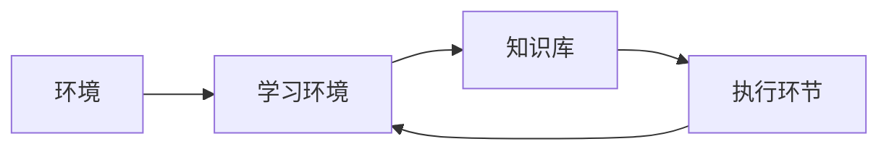

# 人工智能

## 第九章

### 机器学习理论及发展

#### 什么是学习?

学习是

### 机器学习的发展史

1. 探索阶段 
   * 侧重于非符号的神经元模型研究、主要研制通用学习系统。
   * 成果：感知机、决策机

### 9.2机器学习的方法

在具体的应用中，环境、知识库和执行环节决定了具体的工作内容，学习环境所需要解决的我呢提完全由 （环境、知识库、执行环节）决定的

#### 机器学习的方法分类

1. 按照学习方式分类

   * 监督学习
   * 无监督学习
   * 半监督学习
   * 强化学习

   此外、还剋按照学习方法、数据形式、学习目标、许欸小策略等标准分类。

#### 机器学习的方法的一些术语

所有数据的集合称为一个  **数据集**

其中的每条记录是对某个对象的 描述， 称为一个 **样本**。

反映对象某方面的性质的事项，如表中的“色泽”、称为 **特征**

从数据中学习模型的过程称为  “训练” ，寻来你过程中使用的样本 称为 **训练样本**.

