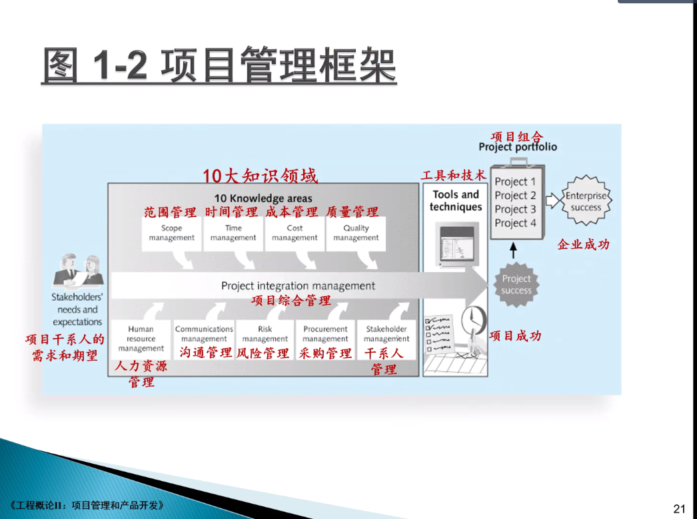

# 工程概论

## 项目管理和产品开发

**项目**:**临时性的的一个目标**

### 什么是项目管理?

* 三要素: 拥有一个范围	

  * 时间(进度)

  * 成本

  * 质量

* 管理什么？

  * 时间、成本、质量、范围、沟通、风险、采购人力资源、干系人。

  * >#### 任正非的管理哲学
    >
    >高层砍掉他们的手和脚，只留下脑袋来仰望心空、洞察市场、规划战略、、运筹帷幄。
    >
    >砍掉中层二点屁股：要多跑：都走出办公室 （中层的领导力）
    >
    >基层的执行力

  * 十大要素

    

###  项目经理 

1. 产品经理
2. 
3. 做事留记录

### 时间管理

> ​	时间、成本、范围之间的关系。项目管理就是在这三点之间找到一个合适的平衡点。

### 项目干系人

韩信封将 ：服众

### 项目团队

## 小结

* 项目是为创造出图特的产品、服务或者结果而进行的临时努力。
* 项目管理是指在项目活动中 运用专门的知识、技能、工具和技术、，以满足项目需求。
* 项目经理 在帮助项目和企业取得成功的过程中起到非常重要的作用。
* 项目管理专业 正在不断的成长和成熟。

## 第二讲 项目生命周期和管理过程组

### 基本要求

* 了解如何系统的观点来描述项目管理.
* 理解项目阶段 和项目生命周期的概念
* 区分项目开发和产品开发的概念
* 掌握可预测生命周期和自适用软件开发生命周期模型
* 了解影响IT项目管理的最新趋势
* 了解项目管理过程组,掌握过程组合十大领域的映射关系.

#### 还原论 $->$ 系统论 $<-$整体论

#### 隆中对

战略规划:	

#### 项目管理的系统观

* 采用整体的和分析的方法来解决复杂问题的问题,包括使用 系统哲学 , 系统分析和系统管理的方法.
* 三个内容
  * 系统哲学: 一整套的思维管理 

#### 组织对标准的要求

* 标准和准则帮助项目经理 提高效率
* 高级管理层可以鼓励
  * 项目管理中标准表格和软件的使用.
  * 比阿尼额项目计划或者提供状态信息指南的开发和使用.
  * 常见项目管理办公室或者卓越中心.

#### 项目阶段和项目生命周期

* 项目阶段
  * 传统项目管理存在一些基本阶段: 概念 ,开发, 试试, 和收尾阶段.
  * 这些姐夫安不可以和后面的 项目管理过程组的启动 ,计划, 执行, 监控, 收尾混淆.
* 项目生命周期: 是一系列项目阶段的集合
* 一个可交付成果是作为项目 的一部分生产力火提供 的产品或者服务.

#### 项目阶段的详细信息

* 在生命周期的**早期**阶段
* 
* 
  * 对资源的需求最低
  * 不确定性程度最高
  * 项目干系人最有机会影响项目的产品, 服务和最终特性
* 在中期阶段
  * 完成项目确定性随之升高
  * 有关项目希求和目标的信息更加丰富
* 最后阶段
  * 保证满足项目需求
  * 项目发起人对仙姑完成情况的认可

