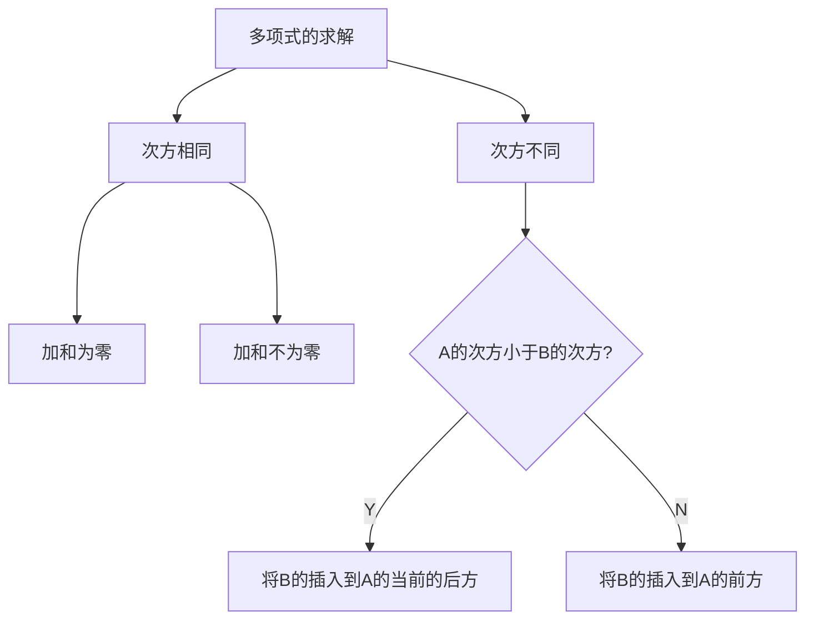
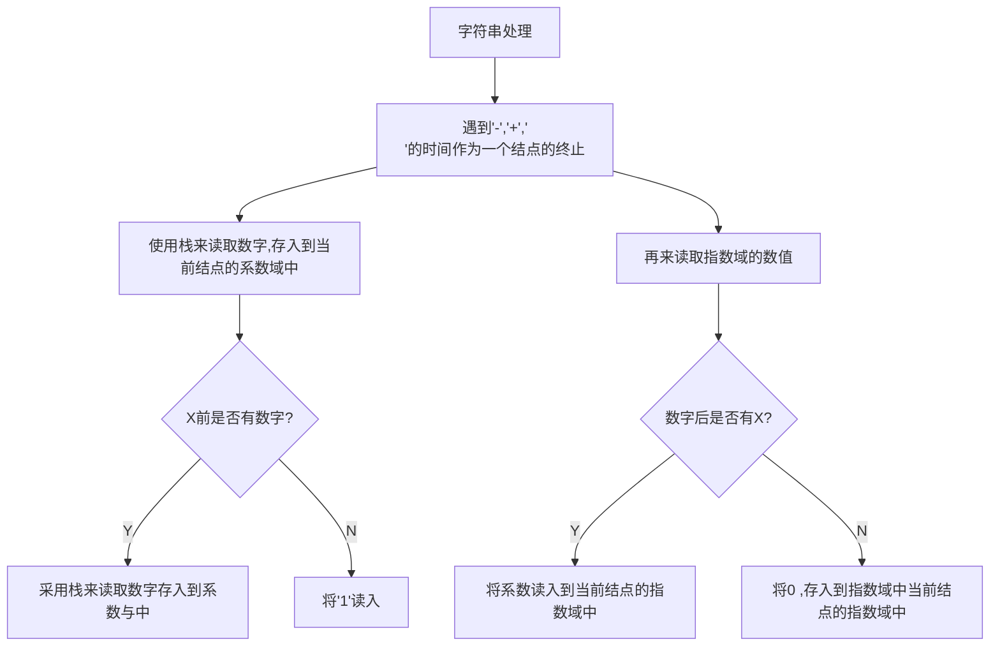

## 多项式求和运算

### 数据结构

采用  单循环链表 来存储 数据 ,方便  前插 和 后插 

```mermaid
graph TD;


A[多项式的求解]-->B[次方相同];
A-->C[次方不同];
B-->加和为零;
B-->加和不为零; 
C-->D{A的次方小于B的次方?}
D--Y-->E[将B的插入到A的当前的后方]
D--N-->F[将B的插入到A的前方]

```

### 算法结构

```mermaid
graph TD;
A[字符串处理]-->B[遇到'-','+','\n'的时间作为一个结点的终止] ;
B-->C[使用栈来读取数字,存入到当前结点的系数域中]
C-->1{X前是否有数字?}
1--Y-->2[采用栈来读取数字存入到系数与中]
1--N-->3[将'1'读入]
B-->D[再来读取指数域的数值]
D-->E{数字后是否有X?}
E--Y-->F[将系数读入到当前结点的指数域中]
E--N-->G[将0 ,存入到指数域中当前结点的指数域中]


```

