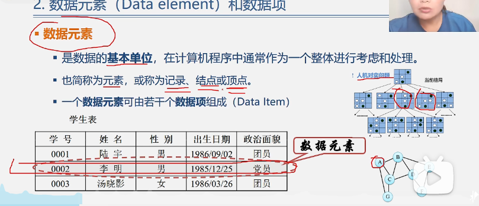

# 													数据结与算法分析

## 第一章

### 1.1 数据结构的研究内容

### 1.2 基本概念和术语1

#### 1.2.1 数据（Data）、数据元素、数据项、数据对象

1. 数据（Data）	

   * 数据是输入计算机并且可以被计算机处理的 **各种符号的集合**
     * 信息的载体
     * 是对客观事物符号化的表示
     * 能够被计算机识别、存储加工

   * 包括：
     * 数值型数据：整数、实数
     * 非数值型的数据：图片、文字、声音等
2. 数据元素
   * 是数据的 **基本单位** ，在计算机程序中通常作为一个**整体**来考虑。
   * 也成为元素、 记录、结点、 或者顶点
   * 
   * 一个数据元素 可以有若干的 **数据项**（Data Item)组成
3. 数据项 
   * 构成数据元素的 **最小单位**
   *  数据、数据元素、数据项三者之间的关系
     * **数据> 数据元素> 数据项**  
       * eg: 学生表-》个人记录-》学号、姓名。。。
4. 数据对象：是 **性质相同的数据元素的集合** ，是数据的一个子集
   * **整数**数据对象 N={0，+1.。。。}
   * **字母字符** 数据对象
5. **数据元素和数据对象爱国之间的关系**
   * 数据元素-------组成数据的基本单位
     * 与数据的关系： 是集合的个体
   * 数据对象--------性质相同额数据元素的集合
     * 与数据的关系： 集合的子集

#### 1.2.2   数据结构

* 数据元素不是孤立的，他们手指间的某种关系 **数据元素相互之间的关系成为 ##结构（Structure）##**
* 指 ** 相互之间存在一种护着多种特定关系的**数据元素的集合

*  数据结构是 **带结构的** 数据元素的集合

##### 数据结构包括三个方面		

1. 数据元素之间的逻辑关系，**逻辑结构**
2. 数据元素及其关系在计算机内存中的表示（称之为映像），成为数据结构的 **物理结构**或数据的 **存储结构**
3. 数据的运算和实现 ,即对数据元素可以施加的操作以及这些操作在相应的存储结构上的实现

##### 数据结构的两个层次

1. 逻辑结构

   * 描述数据元素之间的逻辑关系

   * 与数据的存储无关,独立于计算机

   * 是从具体的问题抽象出来的数学模型

2. 物理结构(存储结构)

   * 数据元素及其关系在计算机存储器中的结构(也解释他的存储方式)

   * 是数据结构在计算机中的表示

* 两者的关系
  * 存储结构是逻辑关系的映像与元素本身的映像.
  * 逻辑结构是数据结构的抽象, 存储结构是数据结构的实现
  * 两者综合起来建立了 **数据元素**之间的结构关系

##### 逻辑结构的种类

1. **划分方法一**
   1. 线性结构
      * 有且只有一个开始和一个终端结点, 并且所有的节点的最多只有一个直接前驱和一个直接后继
      * 例如: 线性表\展\队列\串
   2. 非线性结构
      * ​	一个结点有多个结点前驱和结点后继
      * 例如L图表
2. **划分方法二**： 四类基本逻辑结构
   1. 集合结构： 数据结构属于一个集合
   1. 线性结构： 数据元素之间存在着一对一的关系
   1. 树形结构： 结构中的数据元素存在一对多
   1. 图形结构或者网状结构： 多对多

##### 存储结构 种类（四种)

* 顺序存储结构：
  * 连续的存储单元 **依次** 存储数据元素，数据元素之间的逻辑关系由元素的**存储位置**来表示
  * C语言的数组
* 链式存储结构：
  * 用一组任意的存储单元存储数据元素，数据元素之间的逻辑关系用 **指针来表示**
* 索引存储结构
  * 在存储节点信息的同时漫画建立附加的**索引表**
  * 索引表中的每一项被称为一个 **索引项**
  * 索引项 的一般形式是： (关键字加地址)
  * 关键字是能够唯一标识 一个结点的那些数据项
  * 。 
* 散列存储结构：根据结点的关键字 计算出 该结点的存储地址

#### 1.2.3数据类型和抽象数据类型

##### 数据类型的作用

	* 约束变量或者常量的取值范围
	* 约束变量或者常量的操作

数据类型（DataType）

* **定义**： 数据类型是一组性质相同的 **值的集合** 以及定义于这个值集合上的 **一组操作** 的总称

  **数据类型=值的集合+值集合上的这一组操作**

##### 抽象数据类型（Abstract Data Type）

* **定义**  	一个数学模型以及定义在此数学模型上的一组操作
  * 抽象出数据模型（**逻辑结构**）
  * 定义在数据模型上的 一组 ** 抽象运算**（相关操作）
  * 不考虑计算机内的具体存储结构 与运算的具体实现

##### 抽象数据类型的**形式定义**

>抽象数据类型可用（D，S，P）
>
>ADT 抽象数据类型名{
>
>​	数据对象	
>
>​	数据关系
>
>​	基本操作
>
>} ADT 抽象数据类型名

##### 其中

* 数据对象 、数据关系的定义上使用伪代码表示
* 基本操作定义为
  * 基本操作名（**参数表**）
  * 初始条件（初始条件描述）
  * 操作结果（操作结果描述）

##### **基本操作定义格式说明**

* **参数表：**
  * 赋值参数  ：职位提供操作提供输入值
  * 引用参数： 以&打头，除了可以提供输入值外，还可以返回操作结果

* **初始条件**：描述执行操作之前  数据结构和参数应当满足的条件，假如不满足，操作失败，并且返回出 错信息。若初始条件为空则忽略
* 操作结果： 说明操作正常完成后，**数据结构的变化状况**和应**返回的结果**
* 

##### 概念小结

### 1.3实现抽象数据类型，“复数的实现”

### 1.4算法和算法分析

算法的定义 ：对待特定的问题的 **求解方法和步骤**的一种描述， 他是 **指令**有限 **的 序列**

##### 算法的描述

* 自然语言
* 流程图： 传统流程图、NS流程图
* 伪代码
* 程序

##### 算法与程序

* 算法是解决问题的 一种方法或者一个过程，考虑如何将输入转换为输出，可以有多个
* 程序是使用某种程序设计语言对算法的实现

##### **算法的特性**： 一个算法必须具有的五个重要**特性**

1. **有穷性： ** 一个算法必须在有穷的步骤之后结束，切每一步都在有穷的时间内。
2. **确定性：**每一条指令必须具有确切的含义，没有歧义！有位移的执行路径，即对形同的输入只能得到 相同的输出。
3. **可行性：**算法是可以执行的，算法面搜狐的操作可以通过已经实现的基本操作执行有限次来实现。
4. 输入：有**零个**或者多个输入。
5. 输出： 有一个或者多

##### 算法设计的要求

正确性：

- 对于 典型、苛刻 切带有刁难性的机组数据任然满足要求。

可读性： 

- 便与人类阅读
- 晦涩难懂的算法已于隐藏 较多的错误

健壮性：

- 在输入 **非法数据的时间**，算法恰当的反应或者进行相应的处理。
- **处理错误的方法，不是中断算法，而是返回一个表示错误的信息**

高效性：

- 时间短，存储少

##### 算法好坏的分析（算法效率）

- 时间效率：消耗的时间
- 空间效率： 执行过程中锁消耗的存储空间
- 算法时间效率的度量
  - 事前分析法：假设执行每一条语句所需的时间为单位时间。此时对于算法的运行时间准换为 讨论该算法中国所有语句执行的次数，**即频度之和**

##### 算法时间复杂度的渐进表示法

* T1(n)=10 n^2   与   T2(n)=5 n^3

* 辅助函数 f(n),使得当N 取景于武器哦哦给你打的时间，T(n)/f(n)的极限值 **为不等于0的常数**，称  f（n）是T（n）的同量级函数。记作T（n）=O（f（n）），称O（f（n））为算法的渐进时间复杂度 ，**简称时间复杂度。**

  

- 算法中 **基本语句重复执行的次数** **问题规模n**的某个函数f（N），算法的市价度量记作：T（n）=O(f（n）)

