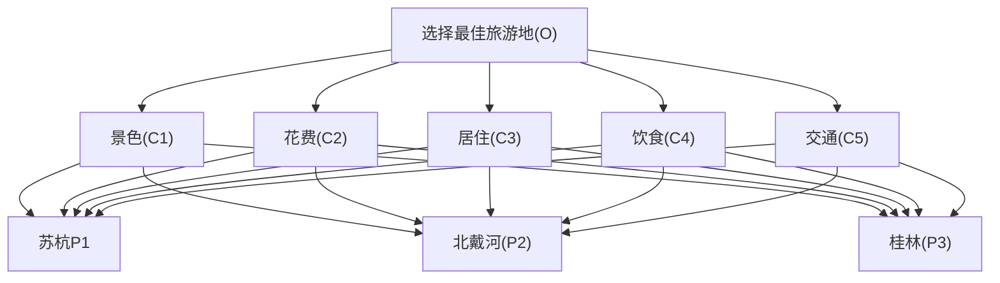

# 数模笔记

## 1.1层次分析法模型部分

#### 权重表格

#### 重要程度

| **标度** | 含义                                                         |      |
| :------- | :----------------------------------------------------------- | ---- |
| 1        | 表示两个因素相比，具有同样重要性                             |      |
| 3        | 表示两个因素相比，一个因素比另一个因素稍微重要               |      |
| 5        | 表示两个因素相比，一个因素比另一个因素明显重要               |      |
| 7        | 表示两个因素相比，一个因素比另一个因素强烈重要               |      |
| 9        | 表示两个因素相比，一个因素比另一个因素极端重要               |      |
| 2,4,6,8  | A和B相比如果标度为3，那么B和A相比就是1/3(注:这里的重要性有时候解释为满意度更方便理解) |      |
| 倒数     | A和B相比如果标度为3，那么B和A相比就是1/3(注:这里的重要性有时候解释为满意度更方便理解) |      |
|          | （注：这里的重要性 看完解释为满意度 方便理解）               |      |

#### 判断矩阵

|      | 景色 | 花费 | 居住 | 饮食 | 交通 |
| ---- | ---- | ---- | ---- | ---- | ---- |
| 景色 | 1    | 1/2  | 4    | 3    | 3    |
| 花费 | 2    | 1    | 7    | 5    | 5    |
| 居住 | 1/4  | 1/7  | 1    | 1/2  | 1/3  |
| 饮食 | 1/3  | 1/5  | 2    | 1    | 1    |
| 交通 | 1/3  | 1/5  | 3    | 1    | 1    |

总结：5$$\times$$5的方阵，对应的元素为 $$a~ij~$$, 主要的特点为下

1. $$a~ij~$$表示的含义 与 j相比 i 的重要程度
2. 当 i  = j 的时间 ，两者同等重要
3. $$a~ij~$$ > 0 且满足 $$ a~ij~ \times a~ji~$$ =1  称当前矩阵为 正互反矩阵

#### 一致性 检验的步骤

1. ##### 计算 一致性指标 CI

   $$
   CI=\frac{\lambda~max-n}{n-1}
   $$

   

2. 查找对应的 平均 随机 一致性 指标 RI 

   https://max.book118.com/html/2017/0624/117674378.shtm

   

3. 计算  一致性比例
   $$
   CR=\frac {CI}{RI}
   $$

4. 如果 CR < 0.1, 则认为判断矩阵的一致性 可以接受；否则需要矫正。

###### CR>0.1 的时间 ，自行调整至 一致性矩阵方面 ，成比例

#### 一致矩阵计算权重

| 景色   | 苏杭 | 北戴河 | 桂林 |
| ------ | ---- | ------ | ---- |
| 苏杭   | 1    | 2      | 4    |
| 北戴河 | 1/2  | 1      | 2    |
| 桂林   | 1/4  | 1/2    | 1    |

注意， 权重在计算的时间 进行归一化处理 

* 苏杭 = 1/（1+0.5+0.25）
* 北戴河 = 0.5/（1+0.5+0.25)
* 桂林 =0.25/（1+0.5+0.25）

#### 判断矩阵来计算权重

| 景色   | 苏杭    | 北戴河 | 桂林  |
| ------ | ------- | ------ | ----- |
| 苏杭   | 1       | 2      | **5** |
| 北戴河 | 1/2     | 1      | 2     |
| 桂林   | **1/5** | 1/2    | 1     |

### 1.算数平均法求 权重

1. 将判断矩阵按照归 **列** 归一化
2. 将归一化的割各列相加 **按行求和**
3. 将相加 得到的向量中的每个元素 除以 n 得到 权重向量

假设 判断矩阵 为 一个 n 的方阵

那么算数 平均法 求得的 权杖向量  
$$
\color{red}{\omega_i=}\frac{1}{n}\sum_{j=1}^{n}\frac{a_{ij}}{\sum_{k=1}^na_{ij}} 
$$

### 2.几何平均法

### 3.特征值法 

首先判断矩阵的 一致性可以接受 ， 那么我们可以 仿照 一致矩阵计算权重的方法

1. 求出矩阵 A 的最大特征值 以及 对应的 特征向量
2. 对求出的特征向量 进一步归一化 得到我们的 权重

## 1.2评价类问题三个 问题

1. 评价的**目标**是什么
   1. 为小明同学 选择最佳的旅游景点
2. 达到这个目标 有哪几种可行的方案
   1. 三种，分别是去北京 杭州 桂林
3. 评价的 战地准则是什么
   1. 景色、花费、居住、饮食、交通

## 1.3 层次分析法步骤

1. 

2. 对于同一层次 的个元素 关于上一层次中某一准则 的重要性进行两两比较，构造判断矩阵。 
3. 由 判断矩阵极端被计较元素对于 该准则 的相对权重，并进行一致性检验（检验通过权重才能使用）
   1. 算数平均法
   2. 几何平均法
   3. 特征值法

​    	**以往的论文利用层次分析法解决实际问题时，都是采用其中某一种方法求权重，而不同的计算方法可能会导致结果有所偏差。为了保证结果的稳健性，本文采用了三种方法分别求出了权重，再根据得到的权重矩阵计算各方案的得分，并进行排序和综合分析，这样避免了采用单一方法所产生的偏差，得出的结论将更全面、更有效。**

4. 计算各层元素对系统目标的合成权重 ，并排序

## 1.4 层次分析法的局限性

1. 评价的决策不能太多，n太大导致判断矩阵和一致矩阵差异太大，RI < 15.
2. 如果决策中的数据已知，那么如何利用数据来使得评价 更加准确？
